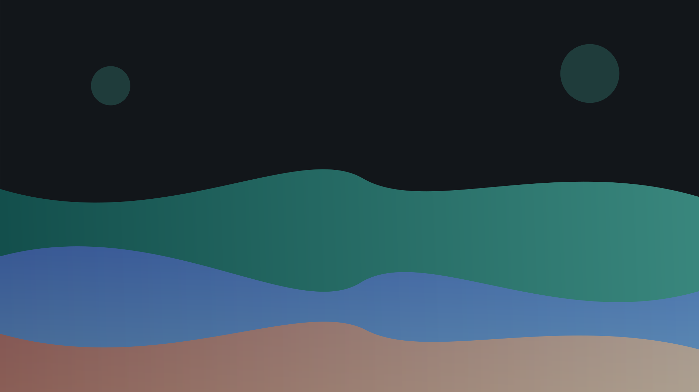
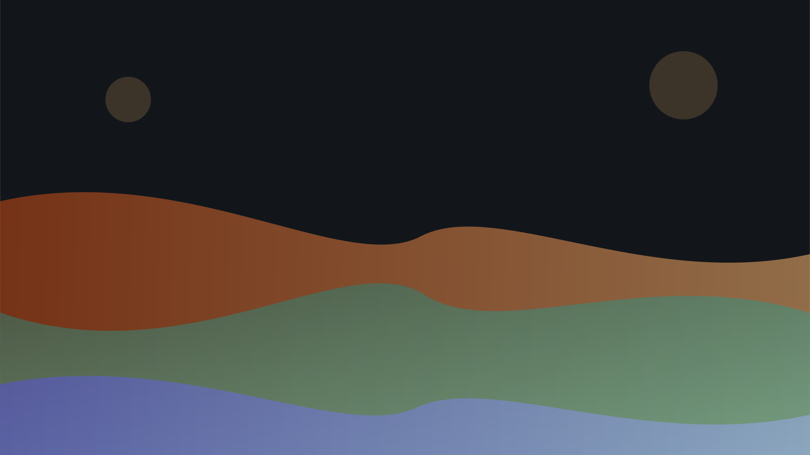
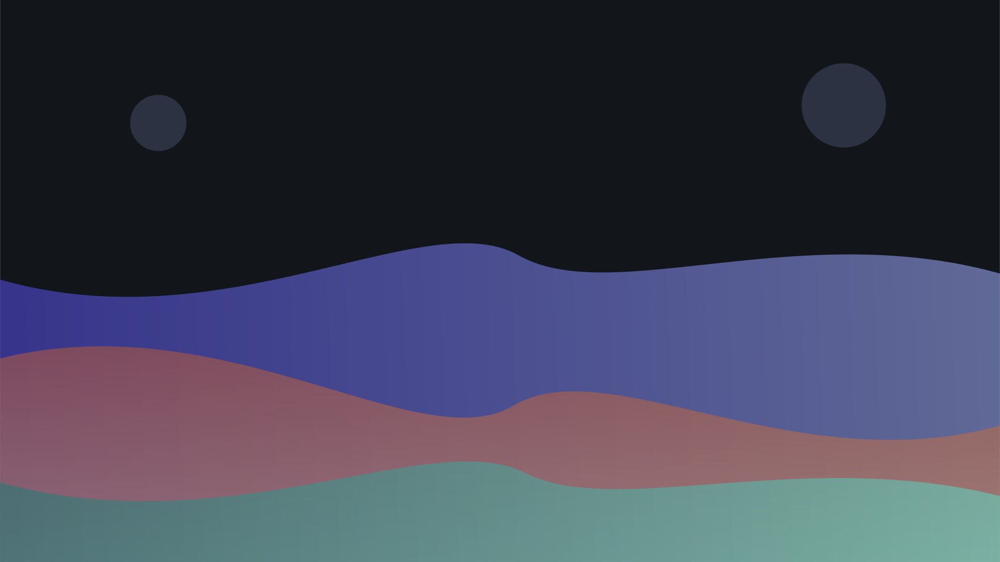
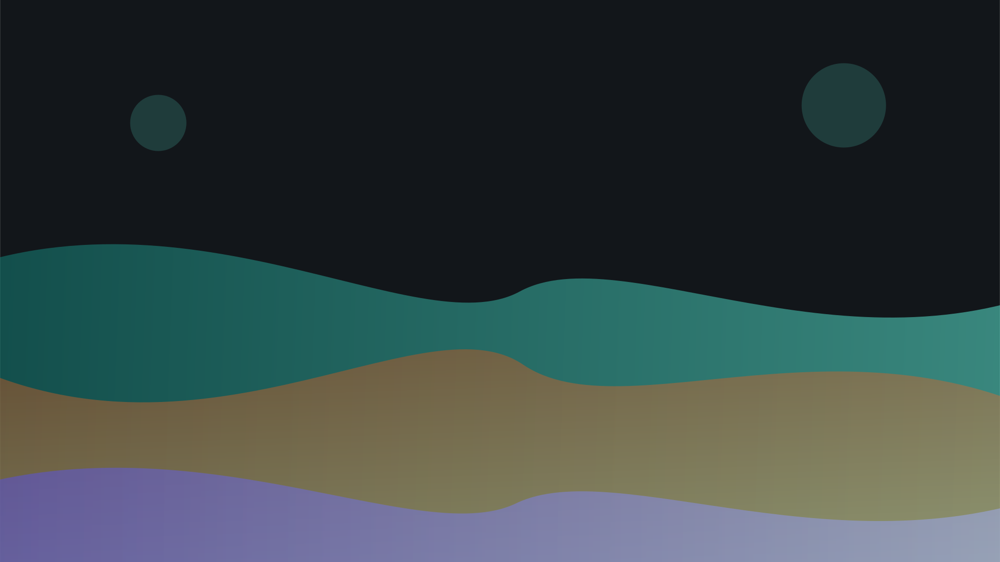
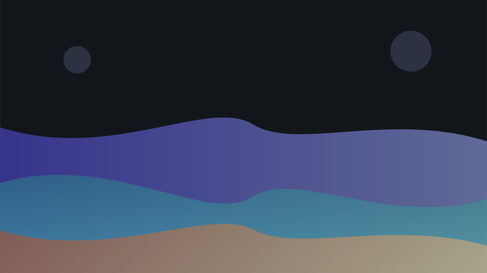

# Astromotion

## An example deck

---

{/* _class: impact */}

who's responsible for this?

who should I yell at?

**Ben Swift**

---

## What is astromotion?

- Astro + Svelte + Animotion (Reveal.js)
- Marp-inspired markdown syntax
- slides separated by `---` thematic breaks
- brand-matched deck theme out of the box

---

## Slide classes

Use a JSX comment to set a class on any slide:

```mdx
{/* _class: impact */}
```

Available classes: `impact`, `hero`, `quote`, `centered`

---

{/* _class: impact */}

big ideas deserve **big slides**

---

## Background images

Full-bleed, split, and filtered backgrounds. Co-locate the image under
`src/decks/assets/` and reference it with a relative path:

```markdown


```

---



## Full-bleed background

This slide uses `![bg brightness:0.6]` with a photo from the hero collection.

---



## Split layout

This slide uses `![bg right:40%]` to put the image on the right.

The content sits in the remaining 60% on the left.

---



## Filtered background

This slide combines `blur:3px` and `brightness:0.2` to keep text readable over a busy image.

---

{/* _class: hero */}



# Hero slides

---

{/* _class: quote centered */}



> The best way to predict the future is to invent it.

---

{/* _class: centered */}

## Centred content

This slide uses `{/* _class: centered */}` to vertically centre everything.

---

## Code blocks

Fenced code blocks get syntax highlighting automatically:

````markdown
```javascript
const greeting = "hello world";
```
````

---

## Code blocks in action

```javascript
import { astromotion } from "astromotion";

export default defineConfig({
  integrations: [svelte(), astromotion({ theme: "./src/decks/theme.css" })],
});
```

---

## Speaker notes

Add notes that appear in the Reveal.js speaker view:

```mdx
{/* notes: Remember to explain this part slowly */}
```

Press **S** right now to see the speaker note on this slide.

{/* notes: This is an example speaker note --- you found it! */}

---

## QR codes

Link to any URL with an animated QR code:

```markdown

```

---

## QR code in action


---

## Reusable partials

Compose decks from shared fragments with `@include` — deck-only partials
live under `src/decks/partials/` and are included by relative path:

```mdx
{/* @include ./partials/closing.mdx */}
```

---

{/* _class: impact */}

go make some slides
